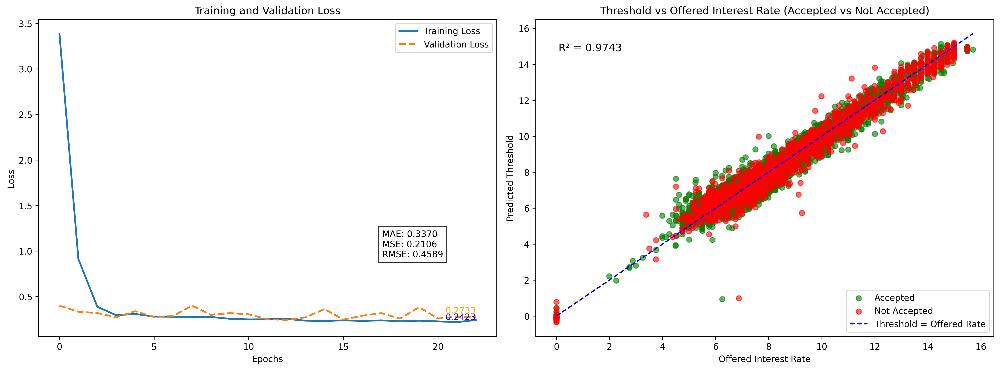
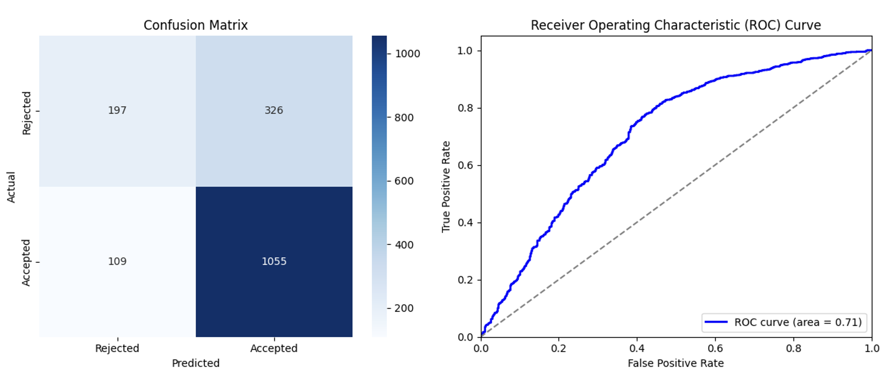
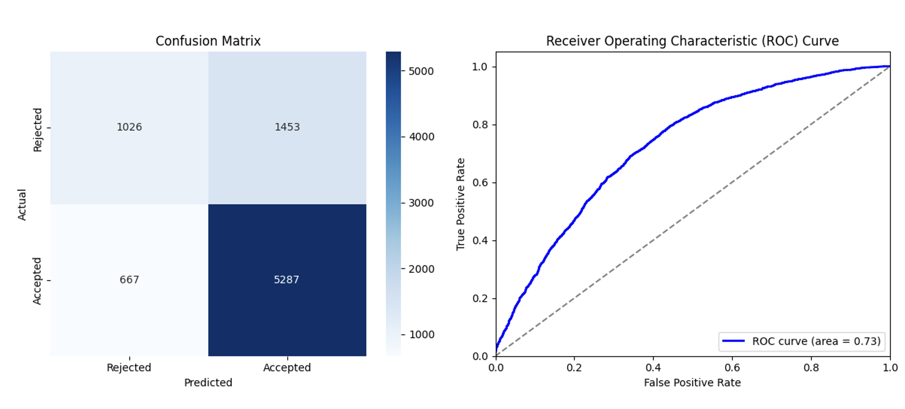
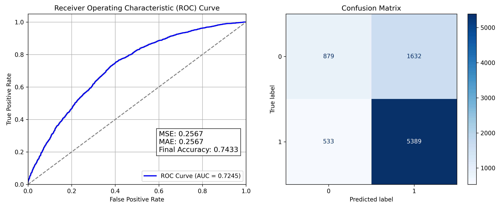
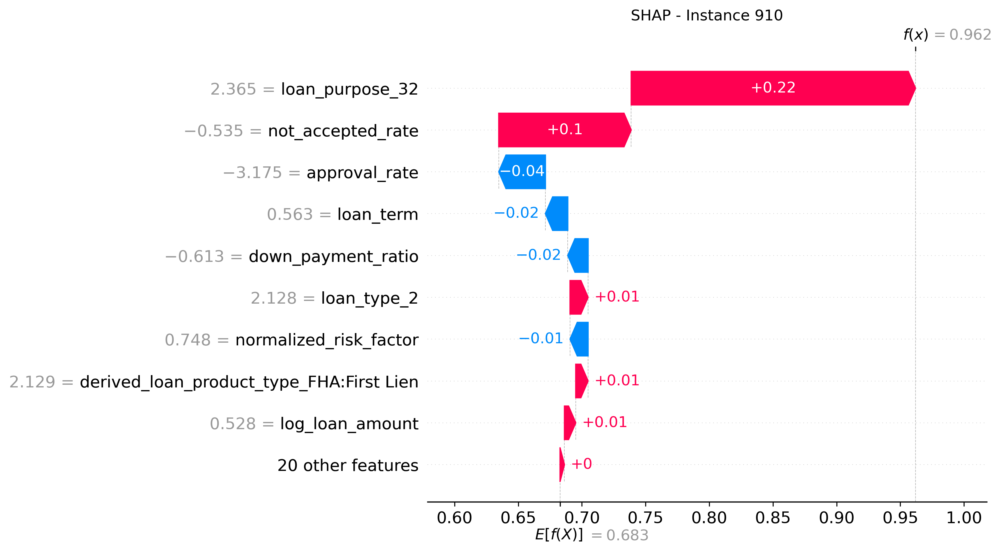
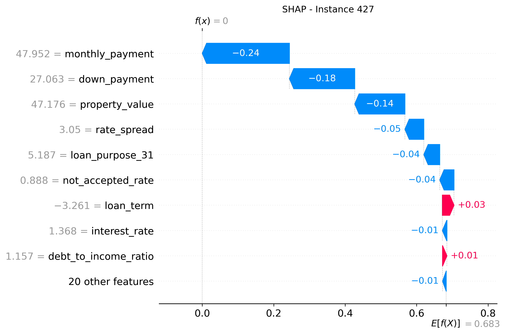
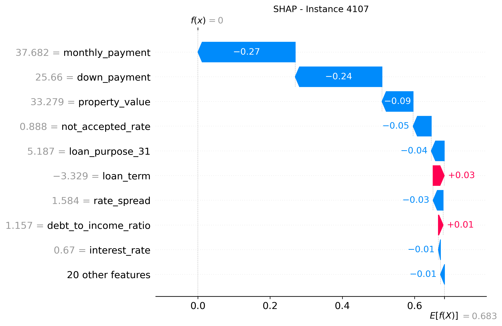

# Consumer Decision Modeling HMDA 2020-2024 Datasets

Author: Samira Jahangiri  
Advisor: Dr. Liqiang Ni  
Data Source: [FFIEC - HMDA Public Data](https://ffiec.cfpb.gov/data-publication/modified-lar/2024)

This project analyzes consumer loan behavior and acceptance decisions using publicly available **Home Mortgage Disclosure Act (HMDA)** data. The goal is to predict:

1. Interest rate offers a consumer is likely to accept (regression).
2. Whether a consumer will accept a loan offer once approved (classification).
3. Key features influencing consumer decisions, using SHAP for explainability.

## Dataset Summary

- Over 10,000,000 loan applications across Florida in 2024.
- Features include:
  - Applicant demographics (age, income)
  - Loan characteristics (amount, term, type, purpose)
  - Institutional patterns (approval & denial rates)

After cleaning:
- Grouped into Loan Originated by Institutions, Loan Approved but Not Accepted by Borrower, and Denied by Institutions.
- Balanced for binary classification between bowrroer accepted vs. declined

### Model 1: Interest Rate Regression (Neural Network)

A neural network was trained to predict the interest rate likely to be accepted by an applicant. 

Architecture:
- Dense(128) → Dense(64) → Dense(32) → Dense(16) → Dense(1)
- Optimizer: Adam  
- Loss: Mean Squared Error  
- Early stopping applied with patience = 10

Performance:
- MAE: 0.3370  
- RMSE: 0.4589  
- R²: 0.9743  

### Actual vs. Predicted Interest Rate Plot:

### Model 2: Acceptance Classification (Threshold-Based)

Using the predicted interest rate threshold vs. actual offer, a binary decision was made:

> If offer < predicted threshold → Accept  
> Else → Decline

Confusion Matrix:
- True Positives: 1,055  
- True Negatives: 197  
- False Positives: 326  
- False Negatives: 109  
- ROC AUC: 0.71

### Model 3: Direct Classification (Neural Network)

A second neural network was trained directly to predict acceptance (0/1) from features.

Confusion Matrix:
- True Positives: 5,287  
- True Negatives: 1,026  
- False Positives: 1,453  
- False Negatives: 667  
- ROC AUC: 0.73

### Model 4: Random Forest Classifier

A Random Forest was trained as an interpretable baseline.

Performance:
- Test Accuracy: 74.3%  
- ROC AUC: 0.7245

### SHAP Explainability

SHAP (SHapley Additive exPlanations) was used to explain model predictions:

Top Influential Features:
1. Rate Spread
2. Loan Purpose
3. Down Payment Ratio
4. Institution's Not Accepted Rate
5. Risk Factor

### SHAP Summary Plots:

SHAP Explaining Factors in Accepting a Loan by a Borrower with Highest Probabilities

SHAP Explaining Factors in Accepting a Loan by a Borrower with Lowest Probabilities

## Insights

- Most loan features (interest rate, loan term, down payment) were similar across accepted and not-accepted groups.
- Rate Spread and Institutional Behavior (approval & denial rates) had major influence on consumer decisions.
- SHAP explained both financial and behavioral factors in borrower acceptance likelihood.

## References

• FFIEC – Home Mortgage Disclosure Act:
https://ffiec.cfpb.gov/data-browser/data/2023?category=states&items=FL

• SHAP Python Package:
https://shap.readthedocs.io/en/latest/index.html

• Scikit-learn (sklearn) Python Library:
https://scikit-learn.org/stable/

• TensorFlow Python Library:
https://www.tensorflow.org/

